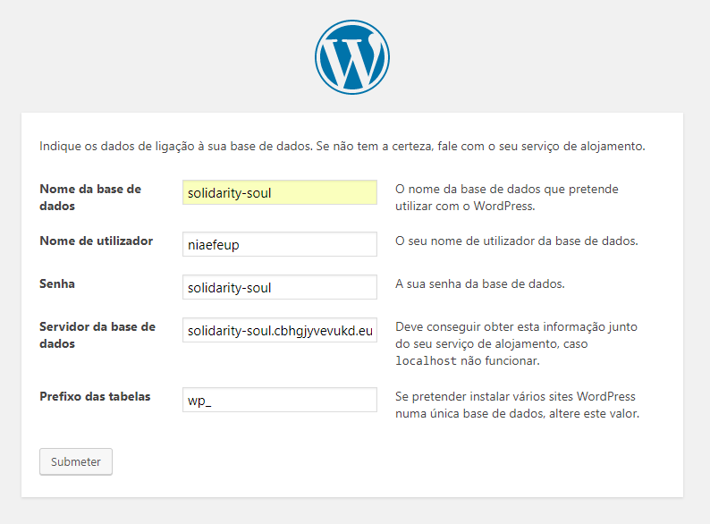

# Solidarity Soul Website

## Setup

- Install [XAMPP](https://www.apachefriends.org/pt_br/download.html)
- Open XAMPP and go to Apache/Config button. 
  - Open the httpd.conf file.
  - Search for 'DocumentRoot' and change the directory for your development directory (like 'C:\Users\guilh\Desktop\FEUP\NIAEFEUP\solidarity-soul-website/wordpress')
  - Place the same directory in the Directory tag that is right next to the DocumentRoot.
  - Save the file and exit.
- Start Apache and MySQL services
- Click the MySQL/Admin button. 
  - The phpMyAdmin page might show up in your browser.
  - Create a new DB called 'solidarity-soul'
- Click the Apache/Admin button
  - A WordPress form will appear.
  - Fill the fields according to the images
  - 
